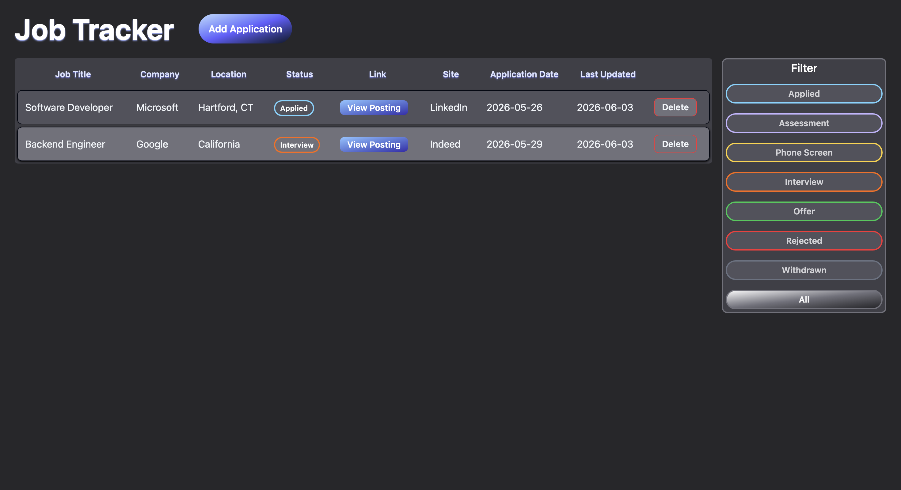

# Job Application Tracker
 
A full-stack web application for tracking job applications throughout the hiring process. Built to replace a manual spreadsheet workflow with a clean, interactive UI backed by a REST API and PostgreSQL database.
 

 
---
 
## Tech Stack
 
**Frontend**
- React (Vite)
- Tailwind CSS
**Backend**
- Node.js + Express
- PostgreSQL (Supabase)
**Testing & CI**
- Jest + Supertest
- GitHub Actions
---
 
## Features
 
- Add, edit, and delete job applications
- Track status through the full hiring pipeline (Applied → Assessment → Phone Screen → Interview → Offer)
- Filter applications by status
- Click any row to open the edit modal
- Colored status badges for quick visual scanning
- Persistent PostgreSQL database
---
 
## Project Structure
 
```
JobTracker/
├── client/          # React frontend (Vite + Tailwind)
├── server/          # Node.js + Express backend
│   ├── routes/      # API route handlers
│   └── tests/       # Jest + Supertest API tests
├── .github/
│   └── workflows/   # GitHub Actions CI pipeline
└── DESIGN.md        # Full design documentation
```
 
---
 
## Running Locally
 
### Prerequisites
- Node.js v20+
- A PostgreSQL database (e.g. Supabase free tier)
### Backend
 
```bash
cd server
npm install
```
 
Create a `.env` file in the `server` directory:
 
```
DATABASE_URL=your_postgresql_connection_string
```
 
Start the backend:
 
```bash
npm run dev
```
 
The server runs on `http://localhost:5000`.
 
### Frontend
 
```bash
cd client
npm install
```
 
Create a `.env` file in the `client` directory:
 
```
VITE_API_URL=http://localhost:5000
```
 
Start the frontend:
 
```bash
npm run dev
```
 
The app runs on `http://localhost:5173`.
 
### Database Setup
 
Run the following SQL in your PostgreSQL database to create the required table:
 
```sql
CREATE TABLE applications (
    id UUID PRIMARY KEY,
    job_title VARCHAR(100) NOT NULL,
    company VARCHAR(100) NOT NULL,
    location VARCHAR(100),
    status VARCHAR(20) NOT NULL,
    link VARCHAR(500),
    site VARCHAR(100),
    application_date DATE NOT NULL,
    notes TEXT,
    last_updated TIMESTAMP NOT NULL
);
```
 
---
 
## Running Tests
 
```bash
cd server
npm test
```
 
Tests run against a separate test database. Add a `TEST_DATABASE_URL` environment variable pointing to your test database before running.
 
---
 
## Design Documentation
 
See [DESIGN.md](DESIGN.md) for the full API specification, data model, component tree, and UI design decisions.